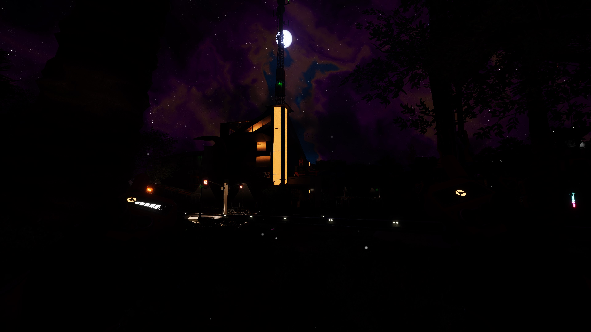

# More Lighting Options

## Description

Beef's More Lighting Options mod gives you additional control over lighting in the game.

### Sun and Moon Brightness
Nights too bright? Days not dreary enough for you? You can increase or decrease the brightness/intensity of both the Sun and the Moon now, with independent settings.

### Sign Emissiveness
Adjust your desired emissiveness level for each emissiveness option for signs (Off, Level 1, 2, 3) in the mod options either on the main menu or in-game. The default values are vanilla, so if you don't notice any changes make sure you've changed the settings!

There's a setting to increase the speed at which Mod Configuration options are applied to signs in-game since it now updates in realtime, at the cost of more flickering and if you have a lot of signs, potential for lag.

  Sign Emissiveness 
  
    
Sun and Moon Brightness
 
  

## Known Bugs
- Untested and unlikely to work in multiplayer and dedicated for now.
- Updating signs, especially with Fast Update enabled, causes flickering. This is an artifact of the update process and there's not much I can do about it

## Changelog
- Version 1.1.1
  - Fixed minor issue where Sun max brightness setting was capped at 2.0 instead of 5.0

- Version 1.1.0
  - Control over sun and moon brightness/intensity values. You can make your sun and moon darker (or brighter) according to your wishes.
  - Changed the default config values for all settings (including signs) to vanilla values, to allow picking and choosing what you want to alter.

- Version 1.0.2
  - You can now see your mod config changes realtime in-game. There's a setting for "fast update" that can be set that speeds it up even more, but can result in flickering as it refreshes which is a vanilla behavior sped up.

- Version 1.0.1
  - Added configuration support - requires reloading the save

- Version: 1.0.0
  - Implemented basic functionality for signs
  - Replaced vanilla values (0,1,5,10) with higher values (0,2,10,50)

## Roadmap

(In most likely order of tackling them)

- [X] Configuration of sign brightness levels can happen in-game
- [ ] Dimmer lights - Allow setting lights lower than 10%, as sometimes this is still too bright
- [ ] Configure "light cones" emitting from regular lights, allowing them to be reduced or eliminated
- [X] Sun / Moon Brightness Control - to make your day and nights brighter or darker
- [ ] Place a slider in sign menu to give more fine-control over sign emissiveness
- [ ] Test and resolve any multiplayer / dedicated server issues, including synchroniziation of settings

## Credits

Mod created by TheRealBeef, and much thanks to Rex and Mircea so far guiding me through the first steps here.
