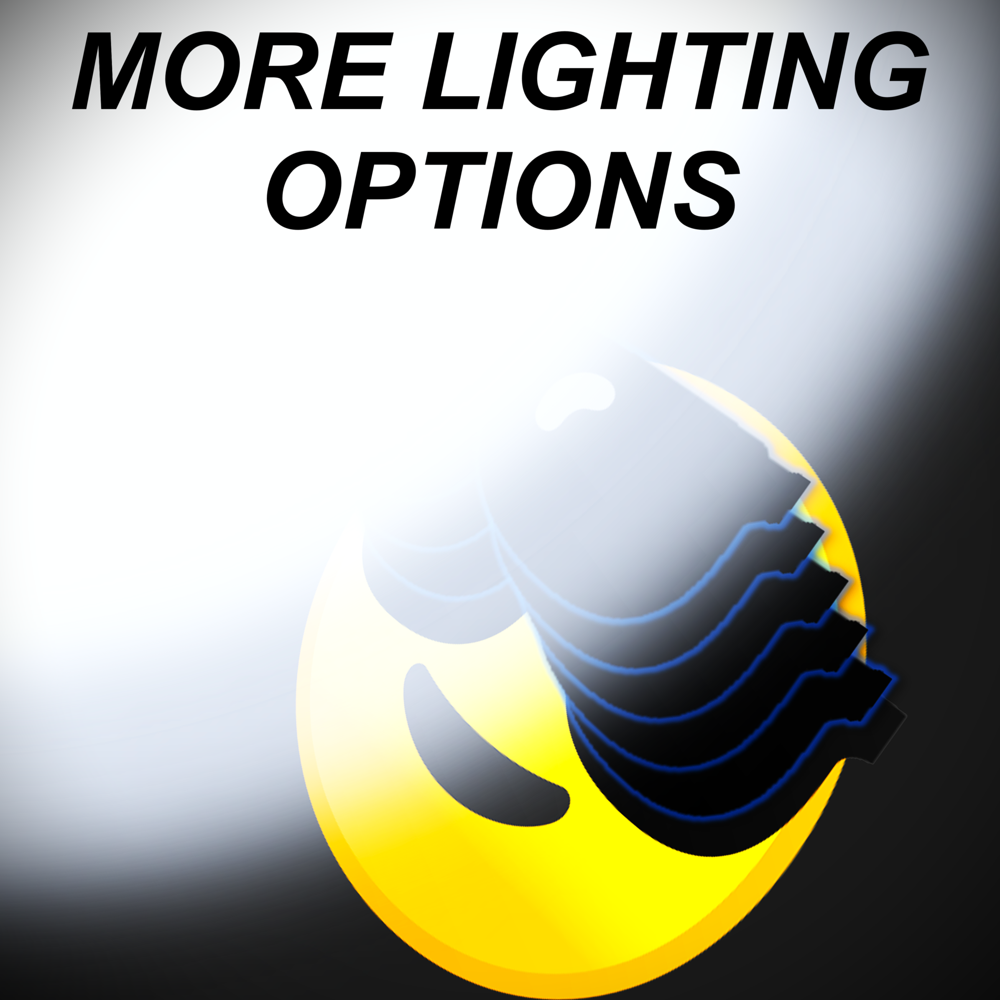
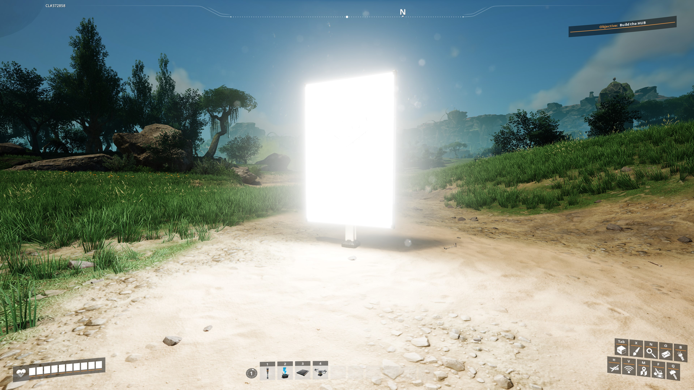

# More Lighting Options

## Description:

Beef's More Lighting Options mod gives you additional control over lighting in the game. Currently its limited to
increasing brightness of signs, but more will come soon.

## Known Bugs:

- Untested and unlikely to work in multiplayer and dedicated for now.

## Changelog

- Version: 0.0.1
  - Implemented basic functionality for signs
  - Replaced vanilla values (0,1,5,10) with higher values (0,2,10,50)

## Roadmap

(In most likely order of tackling them)

- [ ] Configuration of sign brightness levels, so you can set you own values for each of the 3 levels
- [ ] Dimmer lights - Allow setting lights lower than 10%, as sometimes this is still too bright
- [ ] Configure "light cones" emitting from regular lights, allowing them to be reduced or eliminated
- [ ] Sun / Moon Brightness Control - to make your day and nights brighter or darker
- [ ] Place a slider in sign menu to give more fine-control over sign emissiveness
- [ ] Test and resolve any multiplayer / dedicated server issues

## Credits

Mod created by TheRealBeef, and much help to Rex and Mircea so far guiding me through the first steps here.
